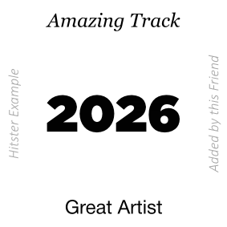

# Personalized Hitster Deck

This project can recover all datas from multiple Spotify playlists and use them to generate custom Hitster cards.

<p align="center">
  
  
</p>

## Usage
1. Set up a `.env` file with your Spotify API credentials:
   ```env
   CLIENT_ID=your_spotify_client_id
   CLIENT_SECRET=your_spotify_client_secret
   ```
   OR
   update the `get_spotify_id` function with your credentials.
2. Install dependencies:
   ```bash
   pip install pandas plotly spotipy tqdm python-dotenv typst
   ```
3. Run the main script with the correct `PLAYLIST` URI.

## Output
- CSV data with columns: top, bottom, center, right, left, qrcode
- Hitster Deck PDF: Printable cards for each track

## Fonts
- Gotham (year)
- Georgia (title)
- Helvetica Neue (artists)
- Calibri (all others)

## Project Structure
- `main.py`: Entry point. Loads playlist or CSV, analyzes, and generates hitster deck.
- `hitster_deck.py`: Deck logic, CSV handling, analysis, Typst card generation.
- `spotify_data.py`: Spotify API integration, playlist fetching, dataframe creation.
- `hitster_card.typ`: Typst template for hitster card layout.
